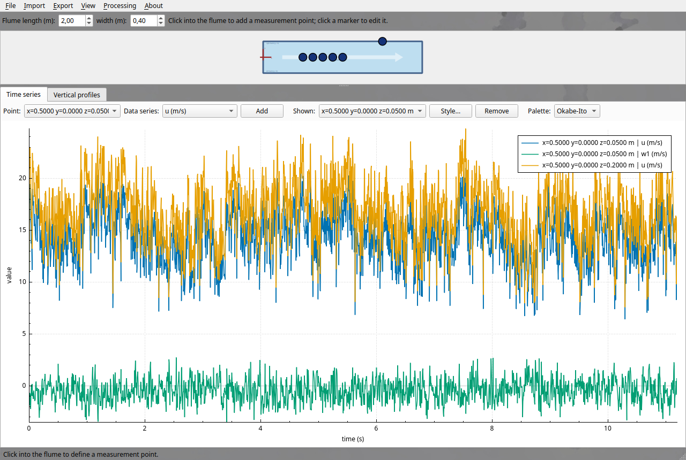
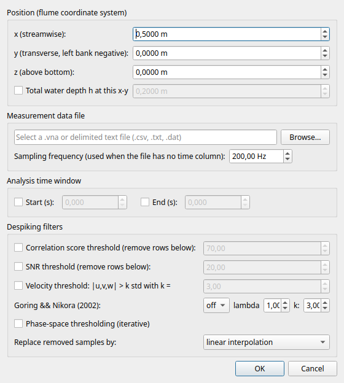
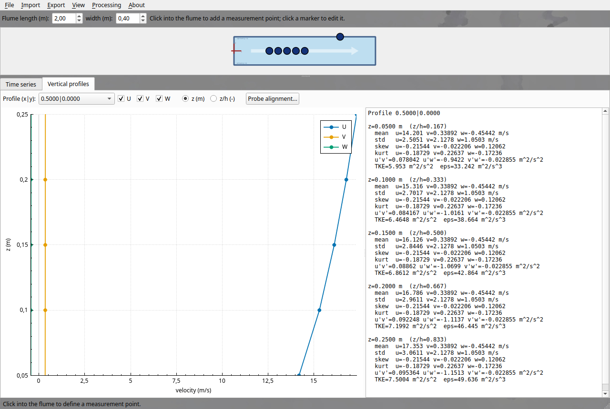

Usage
=====

The main window consists of the interactive flume top view (top) and two
analysis tabs (bottom): *Time series* and *Vertical profiles*.

   *Main window: flume top view with measurement point markers and a time
   series frame with three superposed data series.*

The flume coordinate system
---------------------------

The flume is drawn in a 1:5 aspect ratio with the flow direction from left to
right. The coordinate origin sits at the **center of the inlet**:

* ``x`` points downstream (m),
* ``y`` points toward the right bank; the orographic left bank has negative
  y values,
* ``z`` points upward from the flume bottom (m).

Set the real flume length and width in the toolbar above the drawing; markers
scale accordingly.

Defining measurement points
---------------------------

Click anywhere inside the light blue flume area. The measurement point wizard
opens with the clicked x-y position pre-filled:

   *The point wizard: position, data file, water depth, time window and
   despiking filters of one measurement point.*

* **Position**: x, y, z in meters with four-decimal precision.
* **Water depth**: the total water depth h at this x-y position. Setting it
  turns all markers of that position dark blue and applies the value to every
  point sharing the same x-y (needed for the z/h profile axis).
* **Measurement data file**: one file per point. Supported formats:

  - Nortek Vectrino ASCII exports (``.vna``),
  - delimited text (``.csv``, ``.txt``, ``.dat``), including files with
    free-text header lines and comma, semicolon, tab, or whitespace
    delimiters. A mapping table appears so you can assign the time and
    velocity columns.

* **Sampling frequency**: used when the file has no time column; the time
  axis is then computed from the sample index.
* **Analysis time window**: optional start and end time (s) restricting all
  statistics and plots for this point.
* **Despiking filters** (all optional, chainable):

  - correlation score threshold (default 70),
  - signal-to-noise ratio threshold (default 20),
  - velocity threshold ``|u - mean| > k std``,
  - Goring and Nikora (2002) velocity or acceleration thresholding,
  - iterative phase-space thresholding,
  - removed samples become gaps (NaN) or are filled by linear interpolation.

Click a marker at any time to edit or delete its point. To add many files at
once, use *Import > Import ADV files...*: coordinates are pre-filled from
``XX_YY_ZZ_*.vna`` style file names (values in centimeters, a leading ``__``
means negative).

Time series analysis
--------------------

In the *Time series* tab, pick a measurement point and a data series (u, v,
w1, w2, amplitudes, SNR, correlations, or the instantaneous turbulent kinetic
energy) and press *Add*. Series from different points superpose in the same
frame for direct comparison.

* **Styling**: select a shown series and press *Style...* to set line width,
  color, and style (solid, dotted, dashed, dash-dot) as well as markers
  (off, rectangular, circular, triangular; filled or open; size, line width,
  and color).
* **Palettes**: choose a color-blind friendly palette (Okabe-Ito, Paul Tol
  bright/muted, grayscale) to recolor all series at once.
* **Second frame**: *View > Add plot frame below* stacks a second,
  independent plot frame under the first one.
* Drag to pan and scroll to zoom in the plot.

Vertical profiles and probe alignment
-------------------------------------

The *Vertical profiles* tab plots the mean U, V, and W velocities of all
points sharing one x-y position against z, or against the relative depth z/h
once water depths are set.

   *Vertical profile of the mean velocities with the per-point statistics
   panel: mean, standard deviation, skewness, kurtosis, Reynolds stresses,
   TKE, and dissipation rate.*

The statistics panel on the right lists, for every point of the profile:
mean, standard deviation, skewness, and kurtosis of u, v, w, the Reynolds
stresses u'v', u'w', v'w', the turbulent kinetic energy
``TKE = 0.5 (std_u^2 + std_v^2 + std_w^2)``, and the dissipation rate
estimated from an inertial-subrange fit of the u spectrum.

**Probe alignment**: if the probe was mounted slightly rotated, mean V and W
do not vanish even in uniform flow. Press *Probe alignment...* and the app
proposes heading (about z), pitch (about y), and roll (about x) angles that
zero the mean transverse and vertical velocities and the residual v'w'
coupling of the profile. Accept the proposal or set angles manually; the
correction applies to all points of the profile and can be reset to zero at
any time. The raw data remains untouched.

Exporting results
-----------------

All exports live in the *Export* menu:

* **Plots > Current frame as PNG (300 dpi)**: saves the active frame exactly
  as displayed in print quality.
* **Data > Shown series as CSV**: writes every currently plotted series
  (despiked and alignment-corrected, as shown) with its time column.
* **Data > Point statistics (xlsx)**: one row per x-y-z point with all
  statistics, stresses, TKE, dissipation, magnitude, and direction.
* **Data > Profile statistics (template xlsx)**: writes the per-profile
  vertical statistics with absolute (z) and relative (z/h) depth columns into
  the ``ADV-profiles.xlsx`` template, which also evaluates the total velocity
  magnitude and its direction (in degrees relative to the flume x axis) with
  spreadsheet formulas.

Projects
--------

*File > Save project* stores everything (point definitions, embedded raw data
files, filter settings, alignment corrections, and plot settings) in a single
``.advProj`` file. Because the measurement data is embedded, the project opens
on any other computer without the original data paths: *File > Open
project...* restores the complete session.

Processing settings
-------------------

The *Processing* menu sets how many CPU cores the application may use (never
more than physically available) and whether the first (w1) or second (w2)
vertical velocity beam feeds the W statistics.
