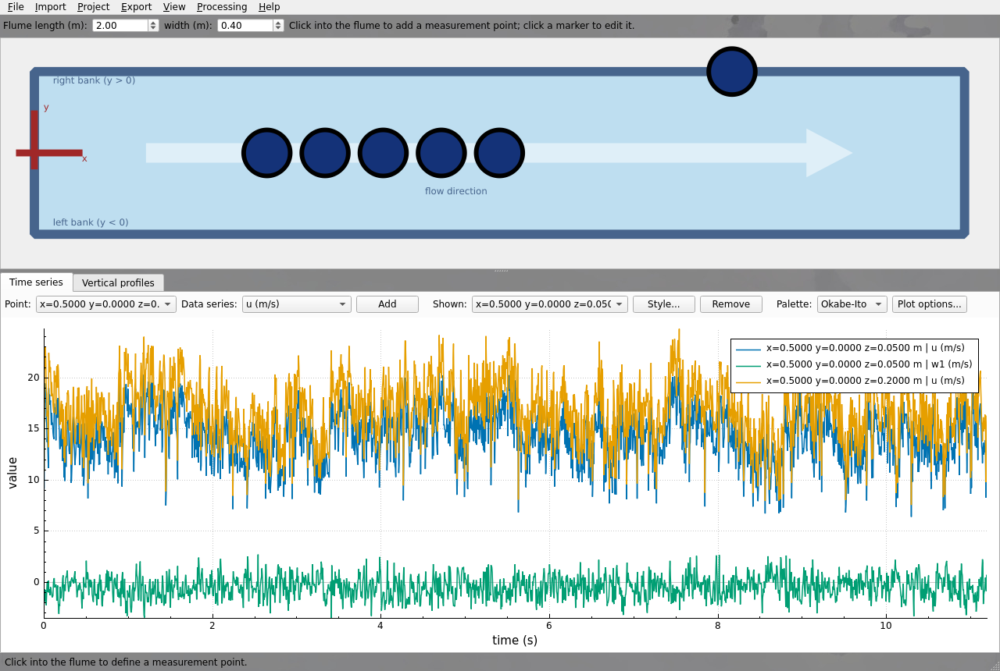
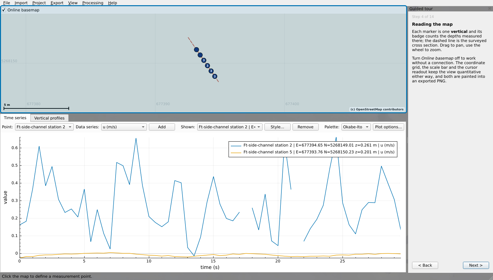
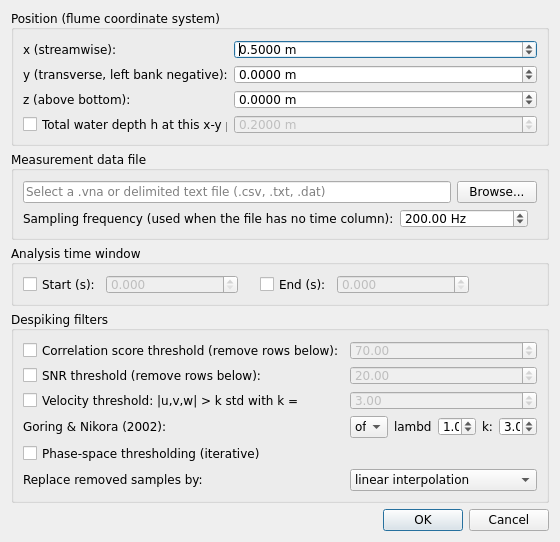
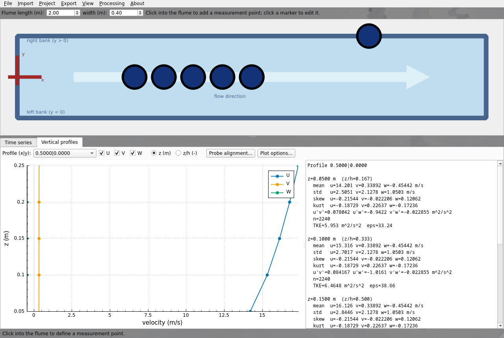
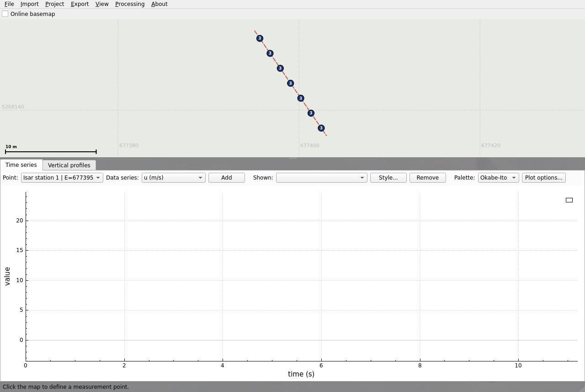

Usage
=====

The main window consists of the interactive flume top view (top) and two
analysis tabs (bottom): *Time series* and *Vertical profiles*.

   *Main window: flume top view with measurement point markers and a time
   series frame with three superposed data series.*

.. _examples:

Start with an example
---------------------

The quickest way to see what the application does is to open a ready-made
project from the *Help* menu, without having any measurements of your own:

* **Help > Load example: Lab (Vectrino)** builds a laboratory project: a
  vertical of five heights at one position in the flume, plus a further point
  downstream, with three series already plotted and the velocity despiking
  filter switched on.
* **Help > Load example: Field (FlowTracker)** builds a field project: a real
  SonTek FlowTracker2 cross section of an Isar side channel, six verticals over
  4.2 m of tape, georeferenced in ETRS89 / UTM zone 32N and drawn on the map.

Both are embedded in the application, so they work offline and on a machine that
has never seen a measurement file. Loading one replaces the current project, and
you are asked first if that would discard anything.

A **guided tour** opens with the example and steps through the main functions,
highlighting the part of the window each step describes. It is not modal: you
can click around, try things and close it whenever you like. Reopen it with
*Help > Restart guided tour*, and note that its steps follow the campaign mode
you are in, because what matters differs between the flume and the river.

   *The field example with the guided tour open. The tour panel docks on the
   right and frames the widget the current step is about.*

*Help > Online documentation* opens this manual in your browser.

The flume coordinate system
---------------------------

The flume drawing always fills the available window area: the flume length
spans the full window width and the flume width is stretched vertically to
fill the height of the flume pane (drag the splitter between the flume and
the analysis tabs to resize it). The flow direction is from left to right and
the coordinate origin, drawn as a red cross, sits at the **center of the
inlet**:

* ``x`` points downstream (m),
* ``y`` points toward the right bank; the orographic left bank has negative
  y values,
* ``z`` points upward from the flume bottom (m).

Set the real flume length and width in the toolbar above the drawing; clicked
positions and markers always map to these real dimensions, regardless of how
the drawing is stretched on screen.

Defining measurement points
---------------------------

Click anywhere inside the light blue flume area. The measurement point wizard
opens with the clicked x-y position pre-filled:

   *The point wizard: position, data file, water depth, time window and
   despiking filters of one measurement point.*

* **Position**: x, y, z in meters with four-decimal precision.
* **Water depth**: the total water depth h at this x-y position. Setting it
  turns all markers of that position dark blue and applies the value to every
  point sharing the same x-y (needed for the z/h profile axis).
* **Measurement data file**: one file per point. Supported formats:

  - Nortek Vectrino ASCII exports (``.vna``),
  - delimited text (``.csv``, ``.txt``, ``.dat``), including files with
    free-text header lines and comma, semicolon, tab, or whitespace
    delimiters. A mapping table appears so you can assign the time and
    velocity columns.

* **Sampling frequency**: used when the file has no time column; the time
  axis is then computed from the sample index.
* **Analysis time window**: optional start and end time (s) restricting all
  statistics and plots for this point.
* **Despiking filters** (all optional, chainable):

  - correlation score threshold (default 70),
  - signal-to-noise ratio threshold (default 20),
  - velocity threshold ``|u - mean| > k std``,
  - Goring and Nikora (2002) velocity or acceleration thresholding,
  - iterative phase-space thresholding,
  - removed samples become gaps (NaN) or are filled by linear interpolation.

Click a marker at any time to edit or delete its point. To add many files at
once, use *Import > Import ADV files...*: coordinates are pre-filled from
``XX_YY_ZZ_*.vna`` style file names (values in centimeters, a leading ``__``
means negative).

Time series analysis
--------------------

In the *Time series* tab, pick a measurement point and a data series (u, v,
w1, w2, amplitudes, SNR, correlations, or the instantaneous turbulent kinetic
energy) and press *Add*. Series from different points superpose in the same
frame for direct comparison.

* **Styling**: select a shown series and press *Style...* to set line width,
  color, and style (solid, dotted, dashed, dash-dot) as well as markers
  (off, rectangular, circular, triangular; filled or open; size, line width,
  and color).
* **Palettes**: choose a color-blind friendly palette (Okabe-Ito, Paul Tol
  bright/muted, grayscale) to recolor all series at once.
* **Second frame**: *View > Add plot frame below* stacks a second,
  independent plot frame under the first one.
* Drag to pan and scroll to zoom in the plot.

Vertical profiles and probe alignment
-------------------------------------

The *Vertical profiles* tab plots the mean U, V, and W velocities of all
points sharing one x-y position against z, or against the relative depth z/h
once water depths are set.

   *Vertical profile of the mean velocities with the per-point statistics
   panel: mean, standard deviation, skewness, kurtosis, Reynolds stresses,
   TKE, and dissipation rate.*

The statistics panel on the right lists, for every point of the profile:
mean, standard deviation, skewness, and kurtosis of u, v, w, the Reynolds
stresses u'v', u'w', v'w', the turbulent kinetic energy
``TKE = 0.5 (std_u^2 + std_v^2 + std_w^2)``, and the dissipation rate
estimated from an inertial-subrange fit of the u spectrum.

**Probe alignment**: if the probe was mounted slightly rotated, mean V and W
do not vanish even in uniform flow. Press *Probe alignment...* and the app
proposes heading (about z), pitch (about y), and roll (about x) angles that
zero the mean transverse and vertical velocities and the residual v'w'
coupling of the profile. Accept the proposal or set angles manually; the
correction applies to all points of the profile and can be reset to zero at
any time. The raw data remains untouched.

Exporting results
-----------------

All exports live in the *Export* menu:

* **Plots > Current frame as PNG (300 dpi)**: saves the active frame exactly
  as displayed in print quality.
* **Data > Shown series as CSV**: writes every currently plotted series
  (despiked and alignment-corrected, as shown) with its time column.
* **Data > Point statistics (xlsx)**: one row per x-y-z point with all
  statistics, stresses, TKE, dissipation, magnitude, and direction.
* **Data > Profile statistics (template xlsx)**: writes the per-profile
  vertical statistics with absolute (z) and relative (z/h) depth columns into
  the ``ADV-profiles.xlsx`` template, which also evaluates the total velocity
  magnitude and its direction (in degrees relative to the flume x axis) with
  spreadsheet formulas.

Projects
--------

*File > Save project* stores everything (point definitions, embedded raw data
files, filter settings, alignment corrections, and plot settings) in a single
``.advProj`` file. Because the measurement data is embedded, the project opens
on any other computer without the original data paths: *File > Open
project...* restores the complete session.

Processing settings
-------------------

The *Processing* menu sets how many CPU cores the application may use (never
more than physically available) and whether the first (w1) or second (w2)
vertical velocity beam feeds the W statistics. The w2 choice is unavailable in
field mode, where the probe has a single vertical component.

Field mode: FlowTracker2 river surveys
--------------------------------------

ADV-Explorer handles two kinds of campaign, switched under *Project* and saved
with the project. **Lab (Vectrino)** is the default and behaves exactly as
described above. **Field (FlowTracker)** analyses SonTek/Xylem FlowTracker2
wading measurements on a real map.

   *Field mode: stations placed along a surveyed cross section. The badge on
   each marker counts the measurement depths of that vertical. The basemap is
   switched off here, so this is the offline fallback with its coordinate grid
   and scale bar.*

What changes in field mode
~~~~~~~~~~~~~~~~~~~~~~~~~~

* The flume panel becomes a slippy map with an OpenStreetMap basemap, a
  coordinate grid, a scale bar and a cursor readout.
* Point x and y are easting and northing in a project coordinate system, chosen
  under *Project > Coordinate system*. The z coordinate keeps exactly the
  meaning it has in the flume: height above the bed, in metres, so vertical
  profiles and the z/h axis work unchanged.
* Turbulence quantities are relabelled, for the reasons given below.

Choosing a coordinate system
~~~~~~~~~~~~~~~~~~~~~~~~~~~~

The projections are built into the application, so no PROJ or GDAL installation
is needed. Supported systems are:

* ``EPSG:4326`` WGS 84 geographic and ``EPSG:3857`` Pseudo-Mercator
* ``EPSG:32601`` to ``32660`` and ``32701`` to ``32760``, WGS 84 UTM
* ``EPSG:25828`` to ``25838``, ETRS89 UTM (including 25832 for southern Germany)
* ``EPSG:31466`` to ``31469``, DHDN 3-degree Gauss-Krueger

ETRS89 is treated as identical to WGS 84. The two drift apart by a few
decimetres, which shifts the whole survey uniformly against the basemap and does
not distort the geometry between measurement points. Gauss-Krueger additionally
needs a datum change, which is done with one countrywide transformation and is
accurate to roughly a metre; the coordinate dialog says so when you pick one.
Codes outside these ranges are refused with the supported ranges spelled out,
rather than silently accepted and misplaced.

Importing a survey
~~~~~~~~~~~~~~~~~~

*Import > Import FlowTracker2 survey* reads a whole cross section at once,
because that is what one FlowTracker2 file holds: a row of verticals along a
tape, each sampled at one, two or three fractional depths.

Preferred input is the instrument's own ``.ft`` file. It carries the raw
samples, per-beam SNR and correlation, the height of each measurement above the
bed, and the sample indices the instrument flagged as spikes. Keeping those
flags is what makes ADV-Explorer reproduce the mean velocities and standard
errors the instrument itself reports.

The ``.ft.dat.csv`` and ``.ft.sum.csv`` exports work as a fallback. They are read
by column position, never by header text, because FlowTracker2 translates its
headers into the language of its user interface. They contain no correlation
columns and no spike indices, and they omit the bank stations, so results differ
slightly from the ``.ft`` file and the cross-section ends have to be typed in.

Positioning the stations
~~~~~~~~~~~~~~~~~~~~~~~~

FlowTracker2 records a chainage along the tape, not a coordinate, so the import
wizard asks where the tape was:

* **Along a cross-section line**: give the coordinates of the two ends of the
  tape. Stations are then placed by interpolating their chainage along that
  line. The bank and edge stations of the survey supply the chainages of the two
  ends automatically, which is the reason they are read even though they hold no
  velocity data. The wizard warns when the line length and the tape length
  disagree by more than two percent.
* **From surveyed positions**: read the positions from a GeoPackage point layer
  or a delimited text file with easting and northing columns, matched to the
  stations in order. The wizard refuses a GeoPackage whose coordinate system
  differs from the project one instead of mixing them silently.

The handheld GPS fix stored in the file is shown, but it is used only to centre
the map. Its scatter is several metres, considerably more than the spacing
between stations, so it cannot position them.

Why TKE is called a proxy here
~~~~~~~~~~~~~~~~~~~~~~~~~~~~~~

A FlowTracker2 point is roughly 60 samples taken at 2 Hz over 30 s. That
resolves nothing above 1 Hz and averages over half a minute, so the variance it
yields is not the turbulent kinetic energy a laboratory record measures. It is
still a useful relative indicator between stations of the same survey, which is
why it is computed rather than hidden, but it is labelled **TKE proxy**
everywhere, including in the exported workbooks, so field and laboratory numbers
are never compared as though they were the same quantity.

For the same reason the dissipation rate is reported as *n/a (sampling rate too
low)*. Estimating it needs a resolved inertial subrange and at least 256 samples
per spectral segment, and a FlowTracker2 point provides neither.

Despiking defaults also differ. The instrument reports a correlation score on a
0 to 1 scale, rescaled here to 0 to 100 for consistency; its observed range is
about 5 to 72 with a median near 35, so the Vectrino default threshold of 70
would reject nearly every sample. Field imports therefore start with the
correlation filter switched off and the SNR filter set to the threshold recorded
in the file itself.

Basemap and offline use
~~~~~~~~~~~~~~~~~~~~~~~

Tiles come from ``https://tile.openstreetmap.org`` by default. ADV-Explorer
follows the OpenStreetMap Foundation tile usage policy: it identifies itself, it
requests only the tiles actually on screen with a small number of requests in
flight, it caches them on disk between sessions, and it always shows the
attribution, which is included in exported images as well.

Turn *Online basemap* off, or simply work without a connection, and the map
falls back to a coordinate grid with a scale bar. Panning, zooming, placing and
editing points all keep working, which matters when the survey is being reviewed
in the field. If a tile server refuses requests, the application stops asking for
the rest of the session instead of retrying.

Map data is (c) OpenStreetMap contributors, available under the Open Database
License.
